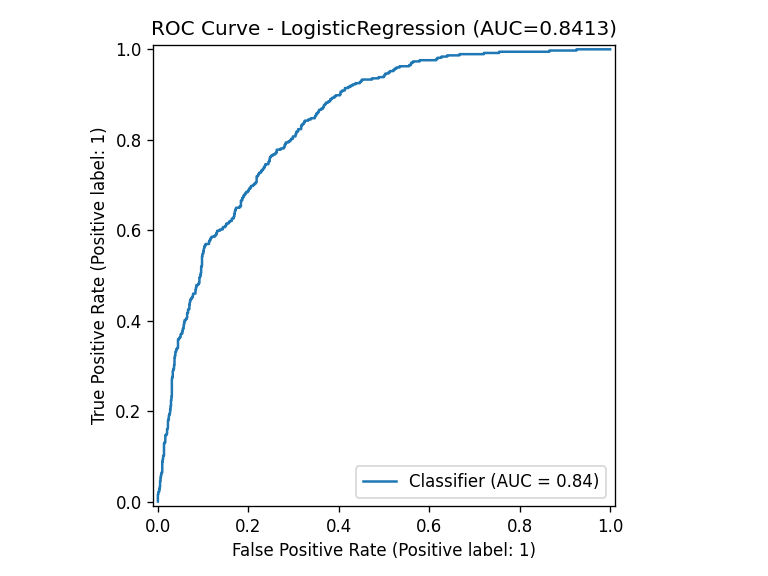
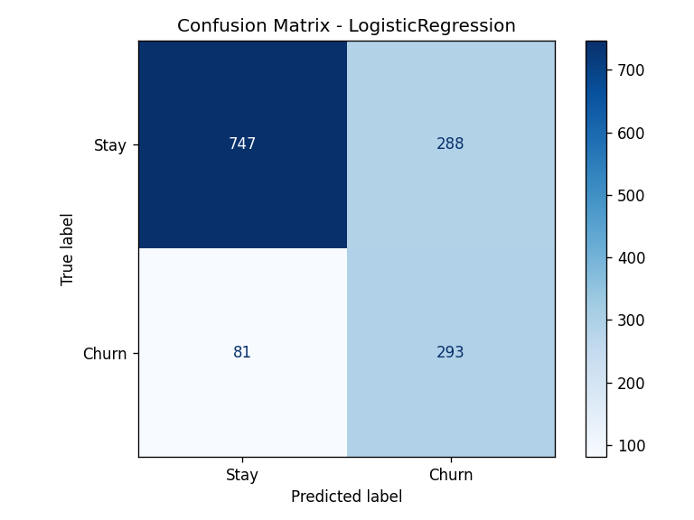
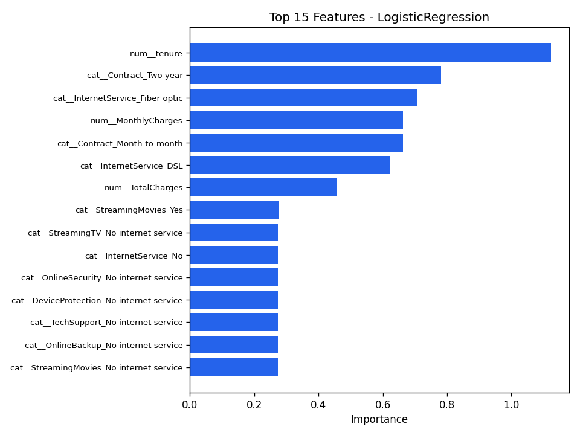

# Customer Churn Prediction

A complete, end-to-end **classic Machine Learning** project that predicts which
telecom customers are likely to leave (churn). Built to demonstrate the full ML
workflow that employers expect from a Data Scientist / ML Engineer: data
handling, preprocessing, model comparison, evaluation, explainability, and a
deployed interactive demo.

> The project runs **out of the box** — if you don't have a dataset, it
> automatically generates a realistic synthetic Telco-style dataset so you can
> train and demo immediately. Drop in the real dataset any time (see below).

---

## What this project demonstrates

| Skill | Where |
|-------|-------|
| Data cleaning & preprocessing | `ColumnTransformer` (impute + scale + one-hot) in `src/train.py` |
| Handling class imbalance | `class_weight="balanced"` / `scale_pos_weight` |
| Model comparison | Logistic Regression vs Random Forest vs XGBoost |
| Robust evaluation | Stratified 5-fold CV + held-out test set |
| The right metrics | ROC-AUC, Precision, Recall, F1 (not just accuracy) |
| Explainability | Feature importance / coefficient plots |
| Reproducible pipeline | `scikit-learn` `Pipeline`, saved with `joblib` |
| Deployment | Interactive `Streamlit` web app |

---

## Results

Trained and evaluated on the real **Telco Customer Churn** dataset (7,043 customers).
The best model was selected by 5-fold cross-validated ROC-AUC and evaluated on a
held-out 20% test set.

| Model | CV ROC-AUC |
|-------|:----------:|
| **Logistic Regression** (best) | **0.846** |
| XGBoost | 0.837 |
| Random Forest | 0.821 |

**Held-out test-set performance (Logistic Regression):**

| Metric | Score |
|--------|:-----:|
| ROC-AUC | **0.841** |
| Recall (Churn) | 0.78 |
| Precision (Churn) | 0.50 |
| F1 (Churn) | 0.61 |

> For churn, **recall matters most** — catching 78% of customers who are about to
> leave lets the business intervene with retention offers. The decision threshold
> can be tuned to the actual cost of a retention offer vs. a lost customer.

### ROC Curve


### Confusion Matrix


### Top Features Driving Churn


The most predictive signals match business intuition: **month-to-month contracts**,
**short tenure**, **fiber-optic internet**, and **electronic-check payments** all
strongly increase churn risk.

<!-- Tip: run `streamlit run app.py`, take a screenshot, save it as
docs/images/streamlit_app.png, then uncomment the line below to showcase the demo. -->
<!--  -->

---

## Project structure

```
customer-churn-prediction/
├── README.md
├── requirements.txt
├── app.py                  # Streamlit interactive demo
├── data/                   # datasets (auto-generated if missing)
├── models/                 # saved model + metrics + plots
└── src/
    ├── generate_data.py    # synthetic Telco-style data generator
    ├── train.py            # train + evaluate + save best model
    └── predict.py          # score new customers
```

---

## Quickstart

### 1. Install dependencies
```bash
cd customer-churn-prediction
python -m venv .venv
# Windows:
.venv\Scripts\activate
# macOS/Linux:
source .venv/bin/activate

pip install -r requirements.txt
```

### 2. (Optional) Generate data
Training auto-generates data if it's missing, but you can do it explicitly:
```bash
python src/generate_data.py --rows 7000 --out data/churn.csv
```

### 3. Train the models
```bash
python src/train.py
```
This will:
- compare 3 models with cross-validation,
- pick the best by ROC-AUC,
- evaluate on a held-out test set,
- save `models/churn_model.joblib`, `models/metrics.json`,
- and save plots to `models/reports/` (confusion matrix, ROC curve, feature importance).

### 4. Predict on new customers
```bash
# Score the built-in example customer
python src/predict.py

# Or score a CSV (same columns as training data, without 'Churn')
python src/predict.py --input data/new_customers.csv --output data/predictions.csv
```

### 5. Launch the interactive demo
```bash
streamlit run app.py
```
Adjust customer attributes in the sidebar and get a live churn-risk score.

---

## Using the REAL dataset (recommended for your portfolio)

Download the **Telco Customer Churn** dataset from Kaggle:
<https://www.kaggle.com/datasets/blastchar/telco-customer-churn>

Save it as `data/churn.csv` (the file has the same column names this project
uses), then run `python src/train.py`. The pipeline already handles the quirks
of the real file (e.g. `TotalCharges` stored as text with blank values).

---

## Understanding the results

- **ROC-AUC** — overall ability to rank churners above non-churners (main metric).
- **Recall (Churn)** — of customers who actually left, how many we caught. For
  churn this often matters most: missing a churner costs revenue.
- **Precision (Churn)** — of the customers we flagged, how many actually left.
- **Confusion matrix / ROC curve** — saved in `models/reports/`.

---

## Ideas to extend (great talking points in interviews)

- Add **SHAP** values for per-customer explanations (`shap` is in requirements).
- **Hyperparameter tuning** with `GridSearchCV` / `Optuna`.
- Tune the **decision threshold** to a business cost (e.g. cost of a retention offer).
- Wrap training in an **MLflow** experiment to track runs.
- Serve predictions via a **FastAPI** endpoint and containerize with **Docker**.

---

## What to say about this project on your resume

> Built an end-to-end customer churn prediction system comparing Logistic
> Regression, Random Forest, and XGBoost with cross-validated ROC-AUC, handling
> class imbalance and delivering an interactive Streamlit app for real-time
> scoring and model explainability.
